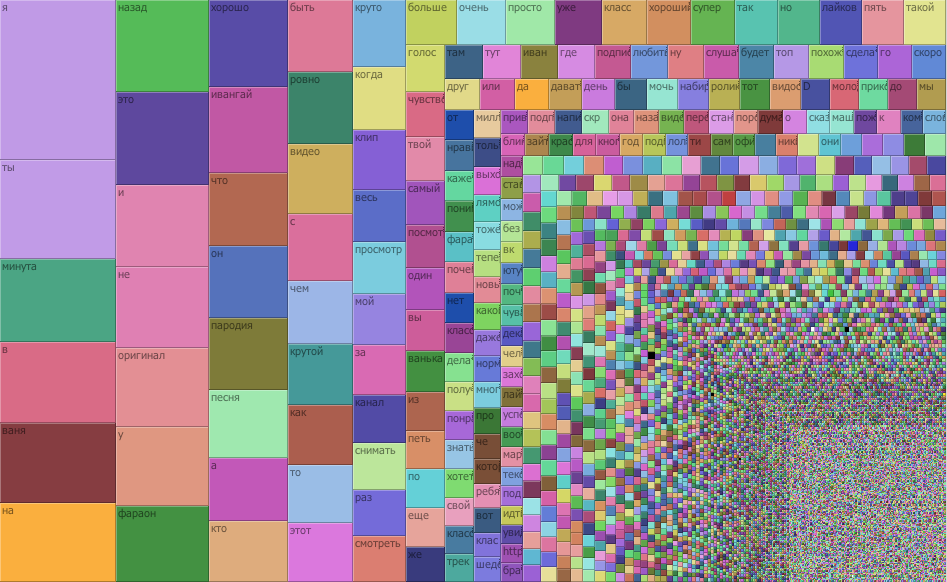
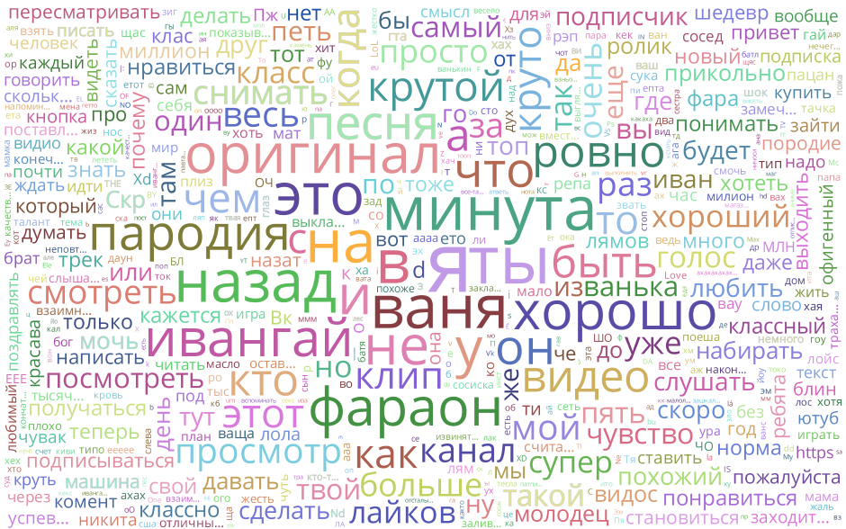

# Youminer

> Node module for analyzing and summarizing Youtube comments


## Installation
```JavaScript
npm i
```

## Usage
```JavaScript
'use strict';

import Youminer from './index';
import jsonfile from 'jsonfile';

Youminer.execute('qP79zHALbH4', result =>
	jsonfile.writeFile('./result.json', result)
);

/**
 *	[
 *    ...
 *	  [
 *		"это",
 *		11355
 *	  ],
 *	  [
 *		"назад",
 *		11415
 *	  ],
 *	  [
 *		"на",
 *		11996
 *	  ],
 *	  [
 *		"ваня",
 *		12197
 *	  ],
 *	  [
 *		"в",
 *		12477
 *	  ],
 *	  [
 *		"минута",
 *		12691
 *	  ],
 *	  [
 *		"ты",
 *		15051
 *	  ],
 *	  [
 *		"я",
 *		24597
 *	  ]
 *    ...
 *	]
 */
```

Then you can use visualization tools to make your data beautiful. 

I'll give you a hint:





## Contributing

1. Fork it!
2. Create your feature branch: `git checkout -b my-new-feature`
3. Commit your changes: `git commit -am 'Add some feature'`
4. Push to the branch: `git push origin my-new-feature`
5. Submit a pull request

## History

TODO: Write history

## Credits

TODO: Write credits

## License

MIT © [Valery Lyatsevich](http://lyatsevich.com)
